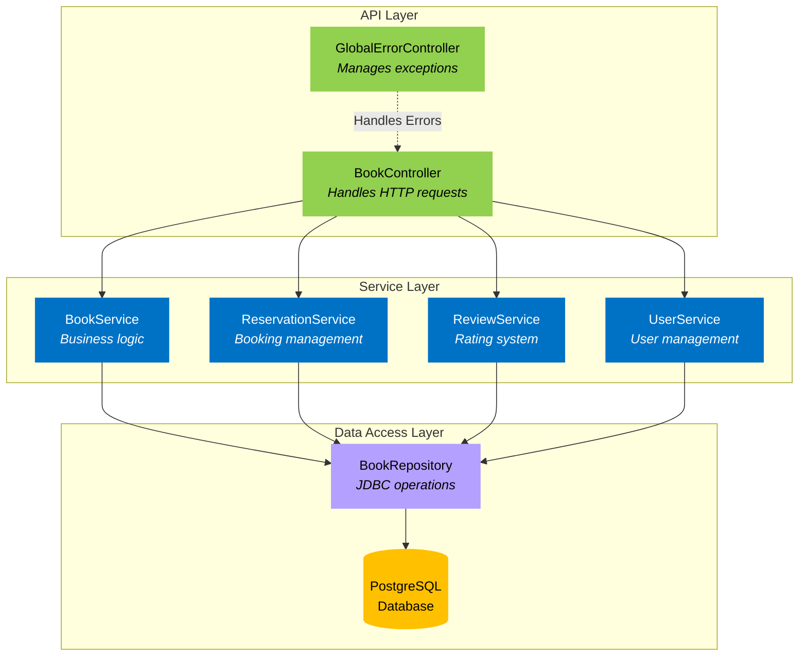
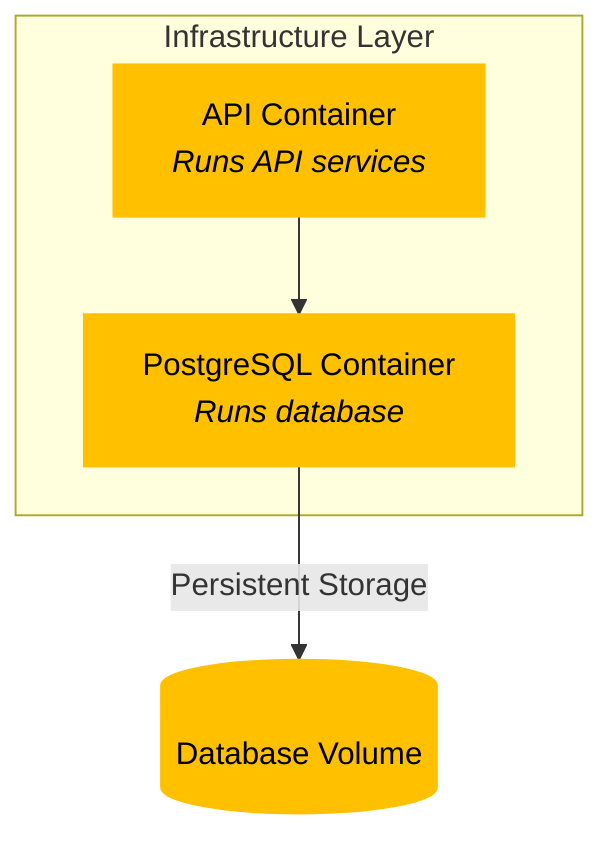
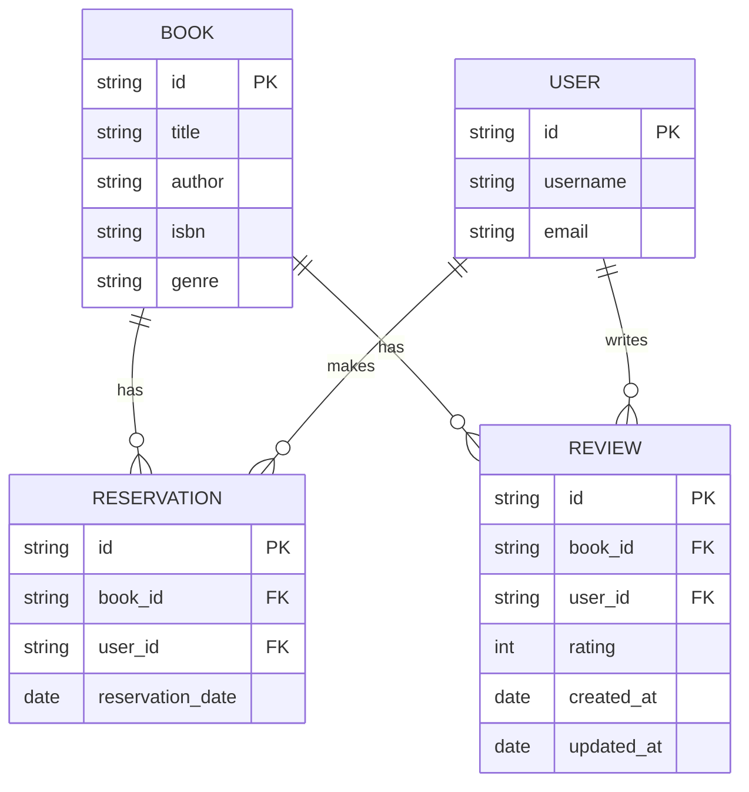

## Architecture Overview
The application is divided into three layers: API, Service, and Data Access. 
The API layer handles HTTP requests and responses, the Service layer contains the business logic,
and the Data Access layer interacts with the database.

## Infrastructure

## Database Schema

## Swagger API Documentation
- http://localhost:8080/swagger-ui/index.html

## References

- [Spring and Postgres Docker](https://www.youtube.com/watch?v=_Gdb-jK3Sr4)
- [Response Entity](https://www.baeldung.com/spring-response-entity)
- [Exception Handling](https://www.baeldung.com/exception-handling-for-rest-with-spring) 
- [Enumerated Types](https://stackoverflow.com/questions/67825729/using-enums-in-a-spring-entity/67826028#67826028)
- [Working With Records](https://www.youtube.com/watch?v=gJ9DYC-jswo)
- [Jason Young](https://www.youtube.com/watch?v=eC5X0NEZ8hE)
- [Pessimistic Locking](https://www.youtube.com/watch?v=0xHdv7LKu1Q)
- [Building Web Application](https://www.youtube.com/watch?v=31KTdfRH6nY)
- [OpenApi Documentation](https://www.youtube.com/watch?v=wtYAqS1GcHE)
- [OpenApi Video](https://youtu.be/2o_3hjUPAfQ?si=pyaFNUmky3oaKJ_5)
- [Devtiro Event-drive Arch with Java](https://youtu.be/HYBtWRPikgo?si=A5nDv7Mby5C96-MD) || I tried... ||
- [Alex Hyett](https://youtu.be/gOuAqRaDdHA?si=2CsFYplJ3Ejfoxe-)
- [Maven vs Gradle](https://youtu.be/5P9cb0xWyO0?si=hxN-yvt9NNcC91tT)
- [Maven Docs](https://maven.apache.org/guides/)
- [Springboot Guide](https://spring.io/guides/gs/spring-boot)
- [Springboot Initalizr](https://start.spring.io/)
- [Github Kafka tutorial](https://github.com/devtiro/microservices-kafka-tutorial) || A...gain ||
- [Github Book Management](https://github.com/beatrizdile/ximple-bookservice)

## Used AI:
- [Claude](https://claude.ai/login)
- [ChatGPT](https://chatgpt.com/)
- [Gemini](https://gemini.google.com/)