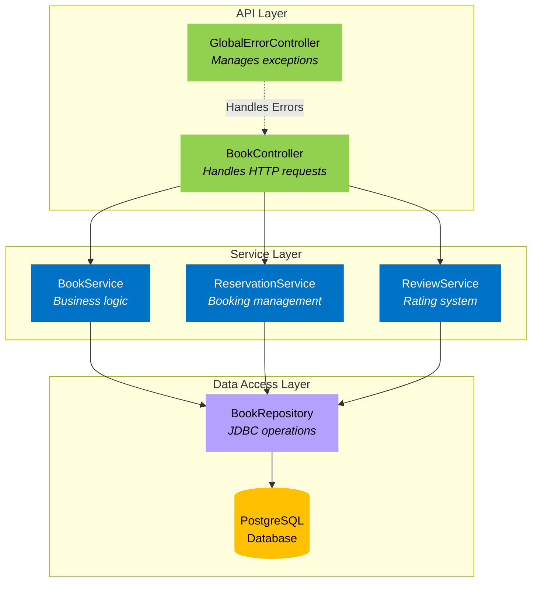
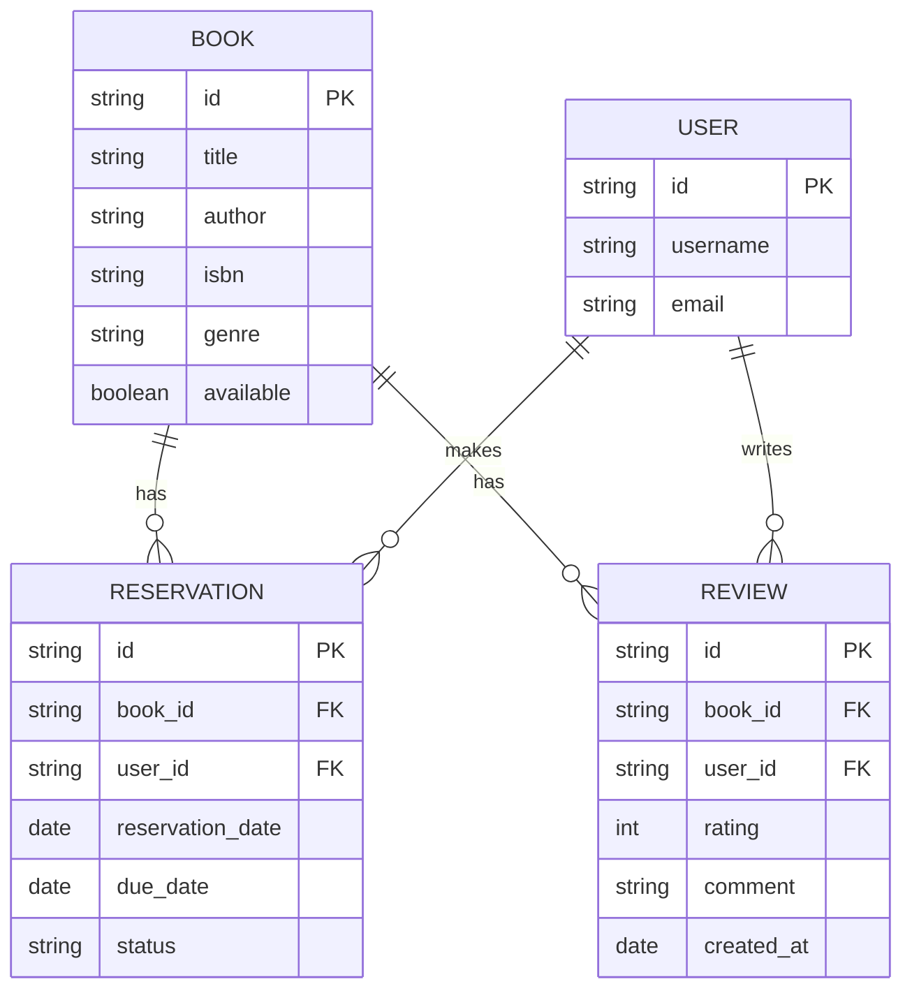

## Architecture Overview

```mermaid
flowchart TD
    classDef api fill:#92D050,color:#000,stroke:#92D050
    classDef service fill:#0072C6,color:#fff,stroke:#0072C6
    classDef data fill:#B4A0FF,color:#000,stroke:#B4A0FF
    classDef infra fill:#FFC000,color:#000,stroke:#FFC000

    subgraph API["API Layer"]
        Controller[BookController<br/><i>Handles HTTP requests</i>]:::api
        Error[GlobalErrorController<br/><i>Manages exceptions</i>]:::api
    end

    subgraph Service["Service Layer"]
        BookSvc[BookService<br/><i>Business logic</i>]:::service
        ReservationSvc[ReservationService<br/><i>Booking management</i>]:::service
        ReviewSvc[ReviewService<br/><i>Rating system</i>]:::service
    end

    subgraph Data["Data Access Layer"]
        Repo[BookRepository<br/><i>JDBC operations</i>]:::data
        DB[(PostgreSQL<br/>Database)]:::infra
    end

    Controller --> BookSvc
    Controller --> ReservationSvc
    Controller --> ReviewSvc
    Error -.->|Handles Errors| Controller
    BookSvc --> Repo
    ReservationSvc --> Repo
    ReviewSvc --> Repo
    Repo --> DB
```

## Database Schema

```mermaid
erDiagram
    BOOK ||--o{ RESERVATION : "has"
    BOOK ||--o{ REVIEW : "has"
    USER ||--o{ RESERVATION : "makes"
    USER ||--o{ REVIEW : "writes"
    BOOK {
        string id PK
        string title
        string author
        string isbn
        string genre
        boolean available
    }
    USER {
        string id PK
        string username
        string email
    }
    RESERVATION {
        string id PK
        string book_id FK
        string user_id FK
        date reservation_date
        date due_date
        string status
    }
    REVIEW {
        string id PK
        string book_id FK
        string user_id FK
        int rating
        string comment
        date created_at
    }
```