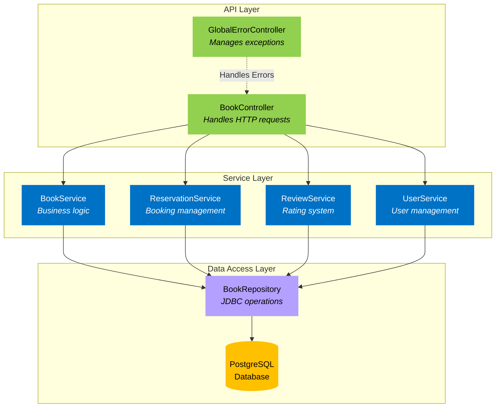
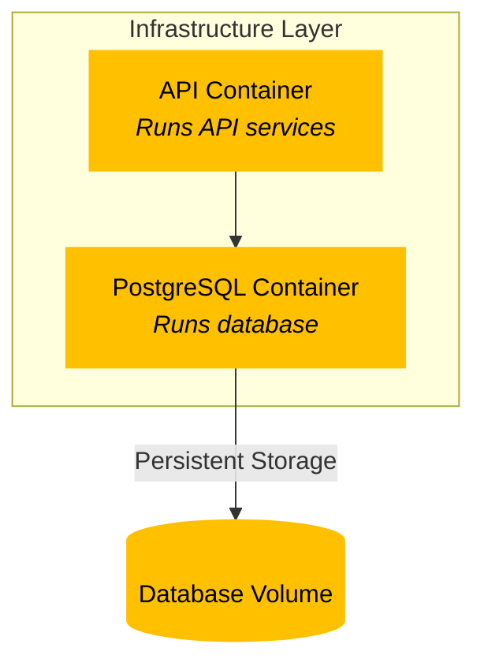
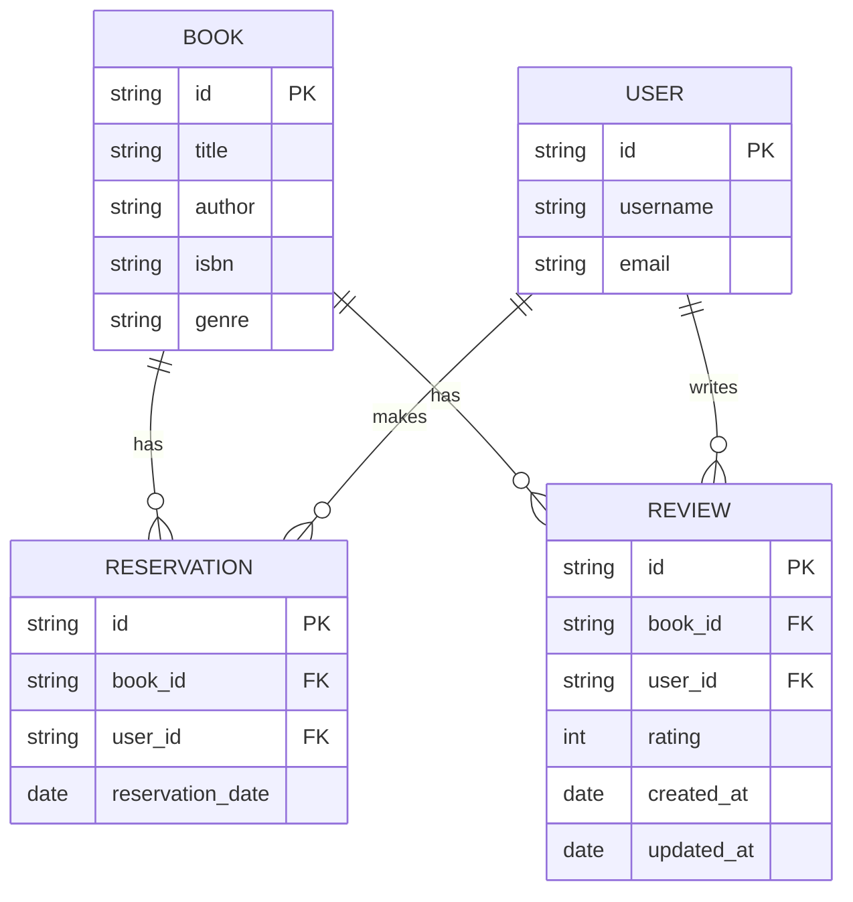
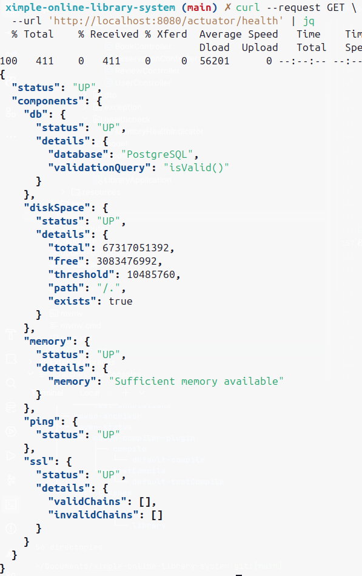

# Book Management System
A simple book management system that allows users to reserve books, rate books, and manage their accounts.

## Table of Contents
- [Features](#features)
- [Technologies](#technologies)
- [Architecture Overview](#architecture-overview)
- [Infrastructure](#infrastructure)
- [Database Schema](#database-schema)
- [Getting Started](#getting-started)
- [Running the Application](#running-the-application)
- [About API Endpoints](#about-api-endpoints)
- [Testing the API](#testing-the-api)
- [Swagger API Documentation](#swagger-api-documentation)
- [References](#references)
- [Used AI](#used-ai)

## Features
- User Management
- Book Management
- Reservation Management
- Rating System
- Error Handling
- API Documentation
- Dockerized
- Database Integration
- Logging
- CI
- Monitoring

## Technologies
- Java 21
- Spring Boot
- PostgreSQL
- Docker
- Swagger
- GitHub Actions

## Architecture Overview
The application is divided into three layers: API, Service, and Data Access. 
The API layer handles HTTP requests and responses, the Service layer contains the business logic,
and the Data Access layer interacts with the database.


## Infrastructure
The application is containerized using Docker. The infrastructure layer consists of an API container, a PostgreSQL container, and a database volume for persistent storage.
I choose to use Docker to containerize the application because it provides a consistent environment for running the application across different platforms and `in my machine it works`.


## Database Schema


## Getting Started
> Before running the application, make sure you have [*Docker*](https://www.docker.com/get-started/) and [*makefile*](https://www.gnu.org/software/make/) installed on your machine.

1. Clone the repository.
2. Run the following command to start the application:
```shell
    make
```

- Have another commands in makefile like:
- `make build` - Build the application.
- `make run` - Run the application.
- `make stop` - Stop the application.
- `make logs` - Show the application logs.
- `make lint` - Lint the application.

## Running the Application
The application runs on port 8080 by default. You can access the application at http://localhost:8080/api/{WhatYouDesire}.

## Swagger API Documentation
Swagger is a tool that helps you document and test your RESTful APIs. You can access the Swagger UI at the following URL:
- http://localhost:8080/swagger-ui/index.html
And check all endpoints and test them.

## About API Endpoints
The application provides a set of RESTful endpoints for managing books, reservations, health check and reviews.
Health check endpoint is used to check the status of the application and commonly used in monitoring tools and not intended for end-users.
Here is how to test health check endpoint:

```shell
curl --request GET \
  --url 'http://localhost:8080/actuator/health' | jq
```

You should see a response similar to this:


## Testing the API
You can test the API using tools like *Postman*, *curl*, *insomnia*, *browser* or *.http file*.
I have provided a sample *[.http file](useful-request-files/generated-requests.http)*, [*insomnia.json*](useful-request-files/Insomnia_import.json) with a bunch of automations and pre-scripts to you don't burn daylight
copying and pasting a lot of data to make requests and test the project. 
You can use this files to test the API endpoints.

## References

- [Spring and Postgres Docker](https://www.youtube.com/watch?v=_Gdb-jK3Sr4)
- [Response Entity](https://www.baeldung.com/spring-response-entity)
- [Exception Handling](https://www.baeldung.com/exception-handling-for-rest-with-spring) 
- [Enumerated Types](https://stackoverflow.com/questions/67825729/using-enums-in-a-spring-entity/67826028#67826028)
- [Working With Records](https://www.youtube.com/watch?v=gJ9DYC-jswo)
- [Jason Young](https://www.youtube.com/watch?v=eC5X0NEZ8hE)
- [Pessimistic Locking](https://www.youtube.com/watch?v=0xHdv7LKu1Q)
- [Building Web Application](https://www.youtube.com/watch?v=31KTdfRH6nY)
- [OpenApi Documentation](https://www.youtube.com/watch?v=wtYAqS1GcHE)
- [OpenApi Video](https://youtu.be/2o_3hjUPAfQ?si=pyaFNUmky3oaKJ_5)
- [Devtiro Event-drive Arch with Java](https://youtu.be/HYBtWRPikgo?si=A5nDv7Mby5C96-MD) || I tried... ||
- [Alex Hyett](https://youtu.be/gOuAqRaDdHA?si=2CsFYplJ3Ejfoxe-)
- [Maven vs Gradle](https://youtu.be/5P9cb0xWyO0?si=hxN-yvt9NNcC91tT)
- [Maven Docs](https://maven.apache.org/guides/)
- [Springboot Guide](https://spring.io/guides/gs/spring-boot)
- [Springboot Initalizr](https://start.spring.io/)
- [Github Kafka tutorial](https://github.com/devtiro/microservices-kafka-tutorial) || A...gain ||
- [Github Book Management](https://github.com/beatrizdile/ximple-bookservice)

## Used AI:
- [Claude](https://claude.ai/login)
- [ChatGPT](https://chatgpt.com/)
- [Gemini](https://gemini.google.com/)